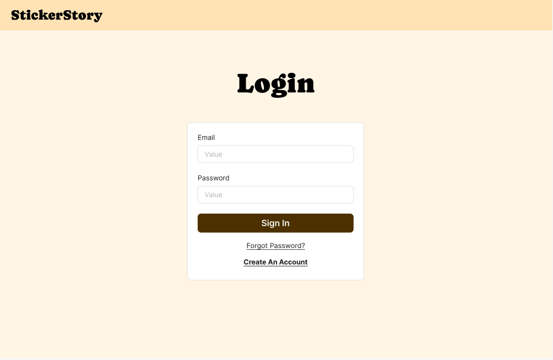
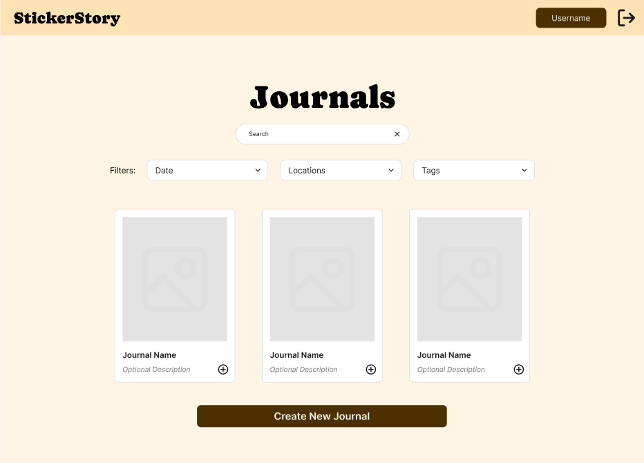
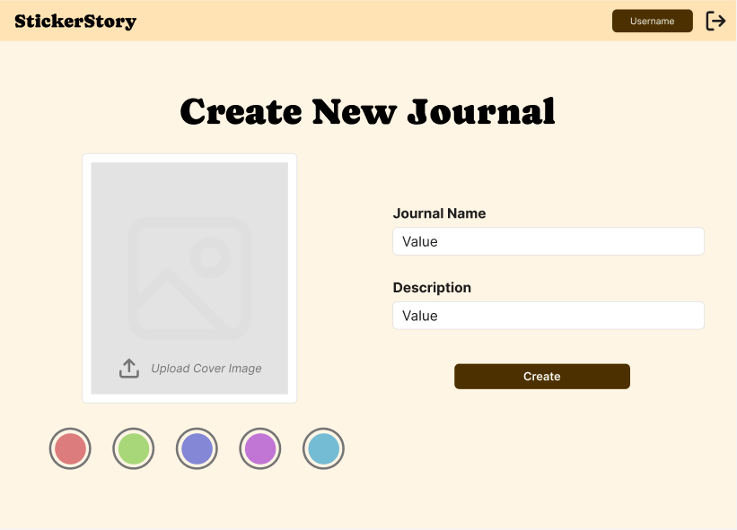
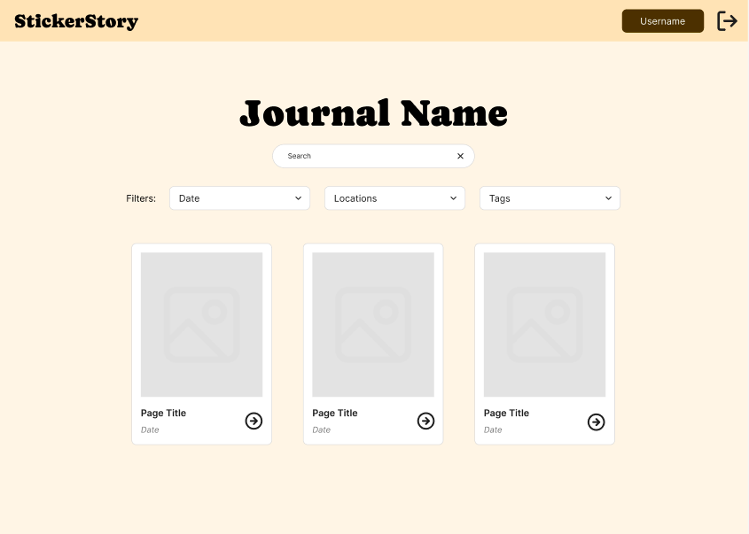
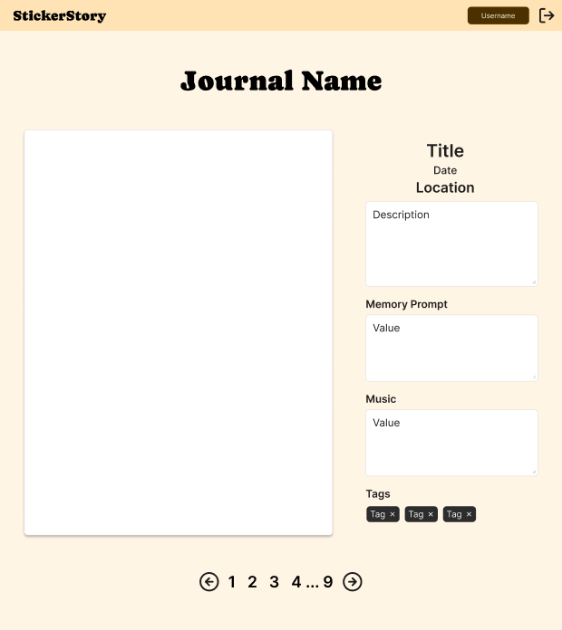
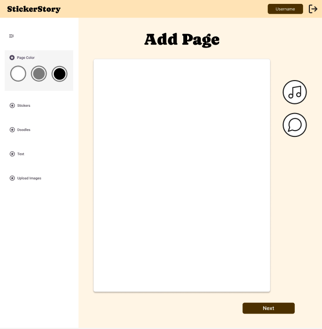
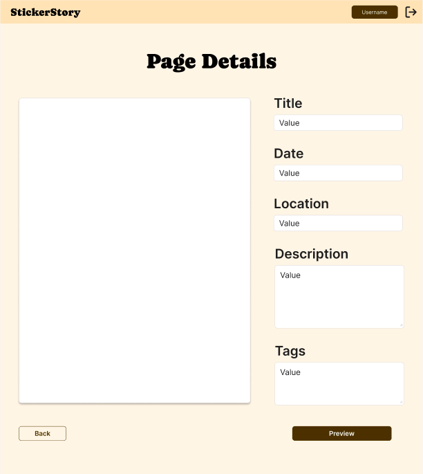
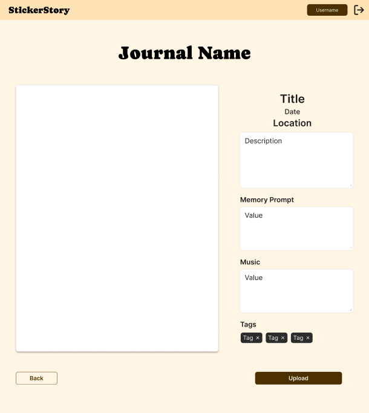

# Wireframes

Reference the Creating an Entity Relationship Diagram final project guide in the course portal for more information about how to complete this deliverable.

## List of Pages
- Landing Page ⭐
- Login Page ⭐
- Sign Up Page
- View All Journals ⭐
- Create New Journal ⭐
- Journal All Page Views ⭐
- Journal Single Page Views ⭐
- Add New Page to Journal ⭐
- Add Page Details ⭐
- Add Page Preview ⭐

[👉🏾👉🏾👉🏾 List the pages you expect to have in your app, with a ⭐ next to pages you have wireframed]

## Wireframe 1: Landing Page

## Wireframe 2: Login Page

## Wireframe 3: View All Journals

## Wireframe 4: Create Journal

## Wireframe 5: Journal All Page View

## Wireframe 6: Journal Single Page View

## Wireframe 7: Add Page View

## Wireframe 8: Add Page Detaisl View

## Wireframe 9: Add Page Preview View

